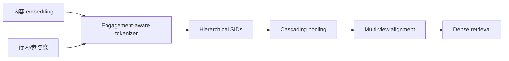

# Pin-SCALE：参与度 Semantic ID 的级联、对齐与工业接入

> **Fidelity: 核心机制复现**。执行 engagement-aware residual codebook 和 SID 级联相似度。

## 论文信息

| 项目 | 内容 |
| --- | --- |
| 论文链接 | [SIGIR 2026 paper P074](https://sigir2026.org/SIGIR2026_program.pdf) |
| 公司/机构 | Pinterest |
| 首次公开日期 | 2026-07-19（Pinterest Labs / SIGIR 2026） |
| 原文开源代码 | 否：论文未提供官方/作者代码（核查日期：2026-07-28） |
| Adapter | `pin-scale` |
| 本地复现代码 | [`src/auto_research/reproductions/pin_scale/`](https://github.com/daiwk/auto-research/tree/main/src/auto_research/reproductions/pin_scale/) |

## 原始论文总结

### 背景与主要改动

Semantic ID 擅长冷启动，但在判别式 dense retrieval 中缺乏系统接入方案。Pin-SCALE 保留 residual hierarchy 做 cascading pooling，以 engagement-aware tokenization 引入协同信号，再用 query-item 与 item-item 多视角对比学习对齐 SID 和参与度预测。



### 核心公式

$$
c_\ell=\arg\min_j w_i\lVert r_\ell-e_{\ell,j}\rVert_2^2,\qquad
\mathcal L=\mathcal L_{\mathrm{rank}}+
\lambda_q\mathcal L_{q,i}+\lambda_i\mathcal L_{i,i}.
$$

### 论文离线与线上效果

Pinterest Closeup、Home Feed、Search 已上线，fresh Repin `+3.67%`、DAU `+0.05%`，每日服务数十亿请求。

## 本地复现

> **本地对照口径**：基线是 unweighted semantic/content ranker；实验组使用 engagement-weighted 三层 SID，NDCG@10 `0.03540→0.04022`，相对 **+13.61%**，fresh Hit@10 相对 `+50.00%`。

fresh 分母很小，50% 不可外推为工业收益。见 [`metrics/movielens-seed42.json`](metrics/movielens-seed42.json)。

```bash
auto-research reproduce --paper pin-scale --dataset-dir data --seed 42
```

## 复现边界

SIGIR program 是当前可核验原始入口；没有伪造 arXiv ID。公开 popularity/transition 仅代理 Pinterest engagement。
