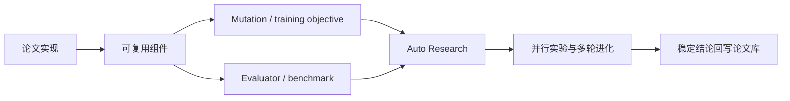

# 论文实现与评测库

想先判断四个领域的经典主干是否完整、还有哪些候选未达到实现门槛，请看[全域论文谱系与缺口](research-lineage.md)。
后续实施顺序和验收条件只在[统一后续路线图与 TODO](research-roadmap.md)维护。

论文实现是研究工作流，不是单一业务领域。仓库用统一的论文信息、实现、数据和指标
合同承载搜广推、基础模型、LLM 后训练与 Agent；实现成熟后，还可以作为 mutation、训练目标或
evaluator 接入[自动研究与进化](auto-research.md)。

## 四个内置研究域

### 搜广推与 LLM 应用

面向互联网公司的推荐、搜索、广告、生成式推荐以及 LLM 与这些系统的结合应用。
该领域坚持真实线上 A/B 硬门槛，并在本地使用公开数据、公平基线和统一对照口径。

- [进入工业论文实现库](reproductions/industrial.md)
- [按公司](reproductions/catalog/by-company.md) ·
  [按主题](reproductions/catalog/by-topic.md) ·
  [按年月](reproductions/catalog/by-month.md)

### 基础模型

覆盖网络结构、预训练数据与优化、多模态表征、长上下文和推理效率。基础模型论文不
强制生产 A/B，而是要求可信公共 benchmark、明确训练预算和可核验方法；本地结果
必须说明模型规模与系统环境折损。

- [基础模型研究总览](foundation-models/README.md)
- [按机构/公司/学校](foundation-models/catalog/by-organization.md) ·
  [按主题](foundation-models/catalog/by-topic.md) ·
  [按年份](foundation-models/catalog/by-year.md)
- [基础模型统一评测协议](foundation-models/benchmark.md)

### LLM 后训练

覆盖偏好学习、RLHF/RLVR、on-policy distillation、reward/credit 和训练稳定性，使用
统一 candidate/free-generation 协议区分机制验证与真实生成。

- [LLM 后训练研究总览](post-training/README.md)
- [后训练方法索引](post-training/catalog.md)
- [后训练统一评测协议](post-training/benchmark.md)

### Agent

覆盖长期记忆、规划与反思、工具使用、多 Agent 协作和自我进化。当前优先实现可在
本地重复执行的机制与 mini-suite，再逐步接真实 LLM executor 和完整 benchmark。

- [Agent 论文研究总览](agent-research/README.md)
- [Agent 方法索引](agent-research/catalog.md)
- [Agent 统一评测协议](agent-research/benchmark.md)

## 统一论文合同

每篇论文页都必须包含：

1. 论文链接、公司/机构、首次公开日期和原作者代码；
2. 本地 adapter 与实现目录；
3. 背景、主要改动、架构图和核心公式；
4. 原论文离线/线上结果与真实对比基线；
5. 本地公开数据协议、稳定指标、运行命令和失败结果；
6. 相对原论文的保真边界。

不同领域可以有不同筛选门槛，但不能混用结果口径：工业 A/B、公共 benchmark 和
本地机制验证会分别标注。

## 统一指标存储

每篇论文的可追溯指标以详情页旁的文件为唯一事实源：

```text
docs/<研究域>/<论文目录>/metrics/<数据集>-seed<seed>.json
```

- 搜广推与基础模型位于 `docs/reproductions/<论文目录>/metrics/`；
- LLM 后训练位于 `docs/post-training/<论文目录>/metrics/`；
- Agent 位于 `docs/agent-research/<论文目录>/metrics/`；
- 文件必须记录 seed、评测层级、claim policy、manifest 引用和数据来源信息；
- checkpoint、完整 trace 和临时 run 只保存在本地 `runs/`，不提交 GitHub。

`docs/experiments/` 只保留“多个方法在同一协议下的横向评测快照”，用于生成统一对比表；
它不能代替单篇论文的指标文件，也不能把不同数据集、不同预算或不同研究域拼成一个
不可比较的日期批次。新增论文必须先写入自己的 `metrics/`，需要横向对比时再由这些
单篇结果生成聚合视图。

## 与自动进化的关系



论文实现先回答“方法是否被正确理解并能运行”，自动进化再回答“将这些方法组合到
当前系统后，什么配置在给定数据和预算下更优”。
