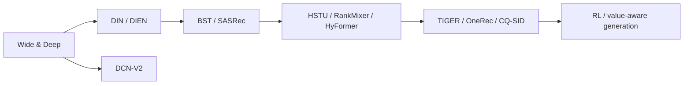
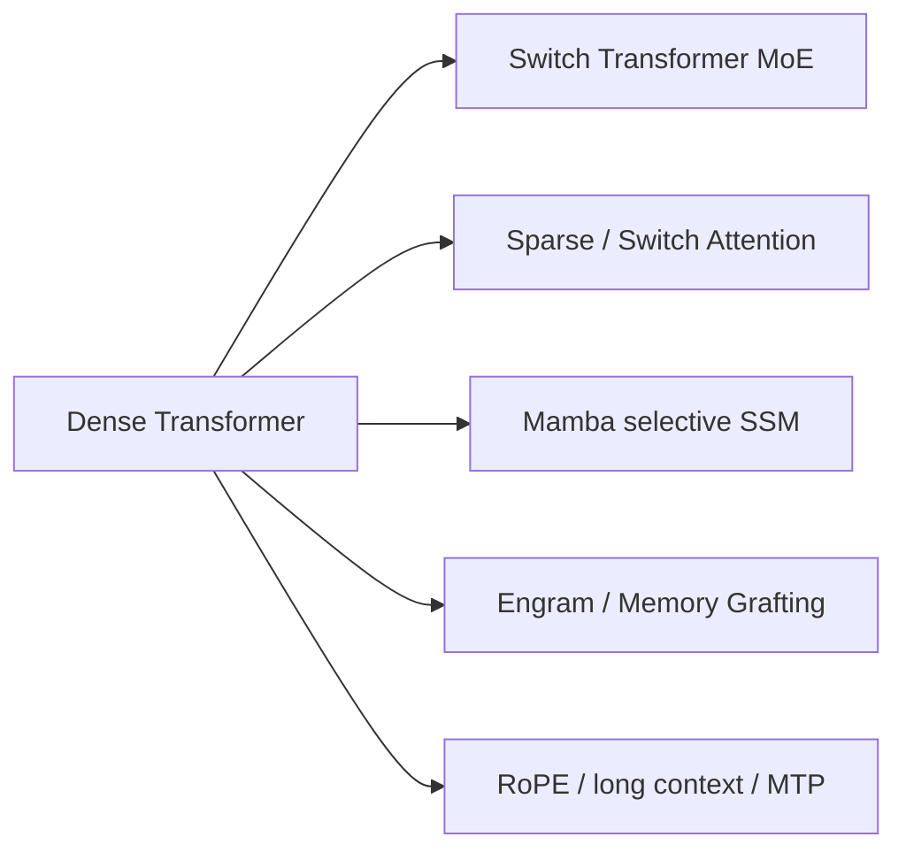

# 全域论文谱系与缺口

本页是跨领域的长期审计入口，覆盖**搜广推、通用 LLM、LLM 后训练和 Agent**。最近一次系统核查截止 **2026-07-28**。单篇实现与指标仍以各论文 README 为准；这里回答“主干是否齐全、下一步缺什么”。

## 统一收录原则

| 领域 | 进入实现队列的证据门槛 | 默认公共评测 |
| --- | --- | --- |
| 工业搜广推 | 量化线上 A/B 或用户明确认可的全流量证据；经典基线仅作具名例外 | MovieLens / Amazon / KuaiRand，全库排序 |
| 通用 LLM | 公开 benchmark、同预算对照，核心算子可真实训练 | WikiText-2、Tiny Shakespeare、任务 mini-suite |
| LLM 后训练 | 明确可执行的 preference/RL objective 与公开评测 | GSM8K candidate、偏好对、过程 trace |
| Agent | 可审计的规划、工具、记忆或反思轨迹 | 确定性工具与跨 episode mini-suite |

## 搜广推：从经典精排到生成式推荐

当前主干已经覆盖经典特征交互、序列兴趣、长序列排序、双塔召回、Semantic ID 生成、LLM 内容/知识增强、采样蒸馏、RL、长期价值和 serving。

| 仍值得补的经典候选 | 价值 | 暂未实现原因 |
| --- | --- | --- |
| DeepFM | FM 与 deep 共享 embedding 的常用 CTR 基线 | 原文没有量化线上 A/B；需作为具名经典例外 |
| YouTube DNN | 两阶段工业召回代表 | 线上口径与公开数据替代仍需单独审计 |
| ESMM / MMoE / PLE | 多任务 CVR 与 shared-bottom 演进主线 | 需先建立含缺失转化标签的统一公开协议 |
| RecoChain / DIG（2026） | 新的生成式/LLM 推荐方向 | 当前未核验到满足硬门槛的量化线上 A/B |

## 通用 LLM：容量、序列与效率

当前覆盖 dense 基线、稀疏 MoE、Mamba、动态/稀疏注意力、条件记忆、长上下文位置编码、MTP 和量化；新算子可进入 LLM evolve 的搜索空间。

- FlashAttention：核心是 GPU kernel 与 IO-aware tiling，应进入 CUDA/Triton 专项，不能用普通 attention 包装冒充。
- RoPE / ALiBi：多个模型内部已使用，仍缺独立同预算长上下文 adapter。
- Chinchilla scaling：需多 compute/data 预算曲线，不适合用单次小模型实验代替。
- 新 MoE routing 与线性序列模型：只有真实算子、梯度和公开 benchmark 都可验证时进入。

## LLM 后训练

经典链路已覆盖 PPO-RLHF、DPO、KTO、ORPO、GRPO、RLOO、ReMax，以及 DAPO、GSPO、SIS、Off-Context GRPO、Lightning OPD、GPRL、TCR。方法差异与缺口见[后训练谱系](post-training/lineage.md)。

下一步重点是统一 rollout 的 on/off-policy 口径，公平比较 reward、KL、长度偏差和 group normalization，并把可组合 objective 暴露给 LLM evolve。

## Agent

经典链路已覆盖 ReAct、Toolformer、Tree of Thoughts、Reflexion、Self-Refine、LATS、ReWOO、AutoGen、Voyager，以及近期记忆与规划方法。完整谱系见[Agent 谱系](agent-research/lineage.md)。

下一步应把 memory、planner、tool policy 和 critic 变成可组合 genome，在同一任务套件比较成功率、token/tool 成本、跨 episode 复用与错误恢复，并区分算法收益和更强 foundation model 的收益。

## 执行优先级

1. **P0 已完成**：Wide & Deep、DCN-V2、DIEN、BST、CS3、CQ-SID、Switch Transformer、Mamba、Switch Attention。
2. **P1 基础设施**：新 LLM 架构进入 evolve；后训练和 Agent 的组合式 genome 接入统一多轮控制器。
3. **P1 论文**：工业新论文继续执行线上证据门槛；DeepFM、YouTube DNN、ESMM/MMoE/PLE 需单独批准为经典例外。
4. **P2 系统复刻**：FlashAttention 等 kernel-first 工作进入 GPU 专项，不用 Mac 近似实现宣称论文复现。
