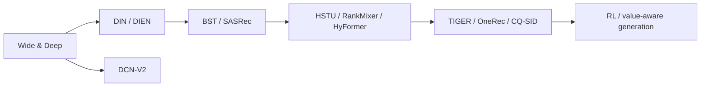
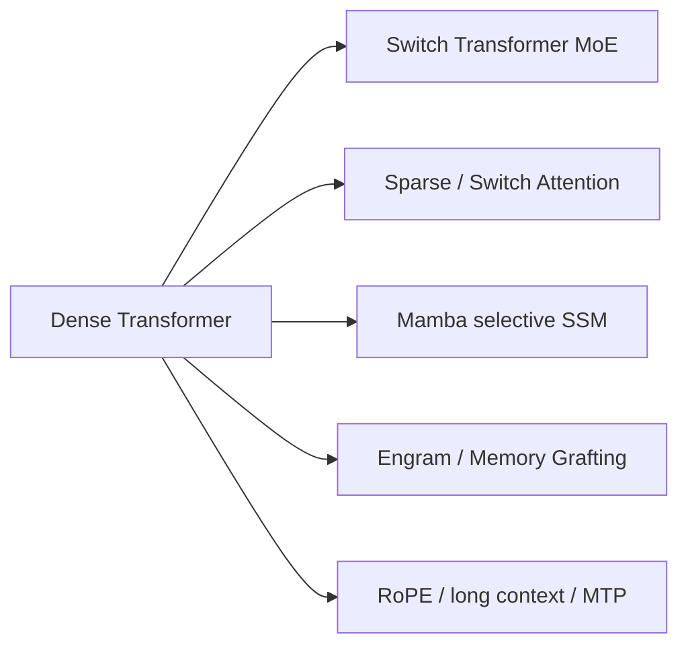

# 全域论文谱系与缺口

本页是跨领域的长期审计入口，覆盖**搜广推、通用 LLM、LLM 后训练和 Agent**。最近一次系统核查截止 **2026-07-29**。单篇实现与指标仍以各论文 README 为准；这里回答“主干是否齐全、下一步缺什么”。

## 统一收录原则

| 领域 | 进入实现队列的证据门槛 | 默认公共评测 |
| --- | --- | --- |
| 工业搜广推 | 量化线上 A/B 或用户明确认可的全流量证据；经典基线仅作具名例外 | MovieLens / Amazon / KuaiRand，全库排序 |
| 通用 LLM | 公开 benchmark、同预算对照，核心算子可真实训练 | WikiText-2、Tiny Shakespeare、任务 mini-suite |
| LLM 后训练 | 明确可执行的 preference/RL objective 与公开评测 | GSM8K candidate、偏好对、过程 trace |
| Agent | 可审计的规划、工具、记忆或反思轨迹 | 确定性工具与跨 episode mini-suite |

## 搜广推：从经典精排到生成式推荐

当前主干已经覆盖经典特征交互、序列兴趣、长序列排序、双塔召回、Semantic ID 生成、LLM 内容/知识增强、采样蒸馏、RL、长期价值和 serving。

| 已补齐的经典例外 | 价值 | 当前状态 |
| --- | --- | --- |
| DeepFM | FM 与 deep 共享 embedding 的常用 CTR 基线 | 已按用户批准的经典例外实现 |
| YouTube DNN | 两阶段工业召回代表 | 已按用户批准的经典例外实现召回与 sampled-softmax 路径 |
| ESMM / MMoE / PLE | 多任务 CVR 与 shared-bottom 演进主线 | 已建立公开多任务协议并分别实现 |

RecoChain / DIG（2026）仍未核验到满足工业论文硬门槛的量化线上 A/B，因此不创建占位 adapter。

## 通用 LLM：容量、序列与效率

当前覆盖 dense 基线、稀疏 MoE、Mamba、动态/稀疏注意力、条件记忆、长上下文位置编码、MTP 和量化；新算子可进入 LLM evolve 的搜索空间。

- FlashAttention：核心是 GPU kernel 与 IO-aware tiling，应进入 CUDA/Triton 专项，不能用普通 attention 包装冒充。
- RoPE / ALiBi：多个模型内部已使用，仍缺独立同预算长上下文 adapter。
- Chinchilla scaling：需多 compute/data 预算曲线，不适合用单次小模型实验代替。
- 新 MoE routing 与线性序列模型：只有真实算子、梯度和公开 benchmark 都可验证时进入。

## LLM 后训练

经典链路已覆盖 PPO-RLHF、Constitutional AI、RRHF、RAFT、DPO、KTO、ORPO、IPO、
SimPO、GRPO、RLOO、ReMax，以及 DAPO、GSPO、LUSPO、CoBA-RL、Lightning OPD、
Relay-OPD、GPRL、TCR、CoRT。四个 sequence objective 进入
真实 tokenizer 自由生成与多 seed 路径；P1 又补齐 SLiC-HF、SteerLM 和 SPIN 的
序列校准、多属性条件 SFT 与自博弈。方法差异见[后训练谱系](post-training/lineage.md)。

后训练论文检索、可审计 objective 映射和组合式 genome 已进入统一多轮控制器。下一步是扩大
公开 rollout 规模，并继续统一 reward、KL、长度偏差和 group normalization 的报告口径。

## Agent

经典链路已覆盖 ReAct、MRKL、HuggingGPT、Toolformer、Tree of Thoughts、Reflexion、
Self-Refine、LATS、ReWOO、AutoGen、WebGPT、SayCan、PAL、ART、Generative Agents、MemGPT、MetaGPT、CRITIC、
SWE-agent、OpenHands、Agent Lightning、SEED、CAST、TurnOPD、Voyager、HiSkill、
UniMem，以及近期记忆与规划方法；软件 Agent
已有真实文件编辑和回归测试路径。完整谱系见
[Agent 谱系](agent-research/lineage.md)。

memory、planner、tool policy 和 critic 已成为可组合 genome，并在同一任务套件比较成功率、
token/tool 成本、跨 episode 复用与错误恢复。后续仍需增加真实浏览器/代码环境 benchmark，
并区分算法收益和更强 foundation model 的收益。

## 执行优先级

1. **P0 已完成**：Wide & Deep、DCN-V2、DIEN、BST、CS3、CQ-SID、Switch Transformer、Mamba、Switch Attention。
2. **P1 基础设施已完成**：新 LLM 架构、后训练和 Agent 的论文约束 genome 已接入统一多轮控制器。
3. **P1 经典论文已完成**：DeepFM、YouTube DNN、ESMM、MMoE、PLE 已按用户批准的经典例外实现。
4. **P2 系统复刻**：FlashAttention 等 kernel-first 工作进入 GPU 专项，不用 Mac 近似实现宣称论文复现。
