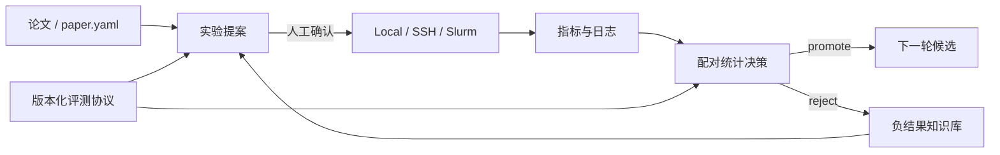

# 自动研究平台 P1

这一层把“能运行一次实验”升级为可跨机器执行、可公平比较、可自动形成下一轮实验，且会记住失败经验的研究闭环。它服务于推荐、基础模型、多模态、LLM 后训练和 Agent，不绑定某一类模型。



## 统一执行后端

同一个 `execute` 命令支持本地、SSH 和 Slurm。每次运行独立保存 `state.json`、标准输出和错误日志，支持持久 FIFO 队列、`--resume` 续跑、硬超时、失败重试、GPU 显存估算与上限检查和成本上限。主机名、分区等机器细节只出现在本次运行参数/产物中，不写入公开文档。

```bash
# 本地
auto-research execute --backend local --run-id smoke -- \
  auto-research reproduce --paper din --budget smoke

# 已配置 SSH 主机；先 dry-run 检查完整命令
auto-research execute --backend ssh --host YOUR_SSH_ALIAS \
  --working-directory /path/to/auto-research --run-id gpu-check --dry-run -- \
  auto-research evolve --model rankmixer --dataset movielens-1m \
  --direction "验证高效 mixer" --generations 2

# Slurm 生成并提交可审计的 job.sh
auto-research execute --backend slurm --partition YOUR_PARTITION \
  --gpu-memory-mb 24000 --timeout 7200 --run-id slurm-run -- \
  auto-research evolve --model micro-llm --dataset wikitext-2 \
  --direction "比较高效注意力" --generations 2
```

SSH/Slurm 不会伪装成本仓库已拥有某个集群；它们是可执行后端，是否能提交由用户的本机 SSH/Slurm 配置决定。

## 公平评测协议

协议 ID 同时冻结数据 revision、划分、候选集合、基线、seed、预算和主指标。只有这些字段完全相同的结果才允许进入横向榜单。

```bash
auto-research protocols list
auto-research protocols show --id recommendation.movielens1m.v2
auto-research protocols compare --left run-a/protocol.json --right run-b/protocol.json
```

内置协议覆盖 `recommendation.movielens1m.v2`、`foundation.wikitext2.v1`、`post_training.gsm8k.v1`、`agent.swe_local.v2` 和 `multimodal.scienceqa.v1`。协议升级必须创建新版本，不能静默修改旧结果的含义。

## 论文到实验提案

提案从单篇 `paper.yaml` 读取核心机制、基线和 Evolve operator，结合目标模型与评测协议生成假设、消融和搜索空间：

```bash
auto-research proposals create --paper PAPER_ADAPTER \
  --model rankmixer --protocol recommendation.movielens1m.v2 \
  --direction "把论文的 mixer 用到 RankMixer" --output runs/proposal.json
```

实时检索后尚未安装的论文可先生成同结构 `paper.yaml`，再用 `--spec path/to/paper.yaml`；来源应标成 `retrieved-paper-component`，不得冒充仓库已实现组件。

每个提案明确标记来源：已安装论文组件、新检索论文组件、参数变体、自动组合或新假设。没有可执行 operator 的论文只会生成设计提案，`executable=false`；所有提案初始状态都是 `awaiting-human-confirmation`，不会直接把自动生成代码晋级到正式实现。

## 统计决策

决策器使用配对 bootstrap 置信区间、配对置换检验和 Holm–Bonferroni 多重比较校正，并结合最小有效提升、最大 seed 数和成本上限给出 `promote`、`continue` 或 `reject`：

```bash
auto-research stats decide \
  --baseline 0.101,0.104,0.102,0.103 \
  --candidate 0.108,0.111,0.109,0.110 \
  --minimum-effect 0.003 --maximum-seeds 9
```

`continue` 会给出建议追加的配对 seed 数；成本超限会直接拒绝，避免仅凭单 seed 峰值晋级。
Evolve 的各领域 evaluator 同时保存 `fitness_by_seed`，每一轮会把父子候选的配对决策写入 `research_memory.statistical_decisions`，下一轮可以据此追加 seed 或拒绝无效方向。

## 负结果知识库

Evolve 默认将失败与不提升结果写入 `.auto-research/negative-results.json`。键包含领域、模型、数据集、协议、方法、预算和 seeds；只有上下文完全相同时才跳过重复实验。改变预算、协议或数据后仍可重试，避免把一次小预算失败误写成永久结论。

```bash
auto-research evolve ... \
  --evaluation-protocol recommendation.movielens1m.v2 \
  --negative-memory runs/shared-negative-results.json
```

负结果类别包括运行失败、数值失败、无提升和目标冲突；详细原因与 fitness delta 同时进入逐轮研究记忆和持久存储。

## 完成边界

- 远程后端提供提交契约，但不会替用户配置 SSH、Slurm 账户或数据挂载。
- 评测协议保证可比性，不把不同数据划分/预算的数字强行放入同一榜单。
- 自动提案不会绕过人工确认和现有 candidate promotion 审核。
- 统计结论是离线实验决策，不替代工业论文的真实线上 A/B 证据。
