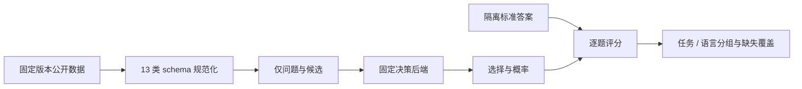
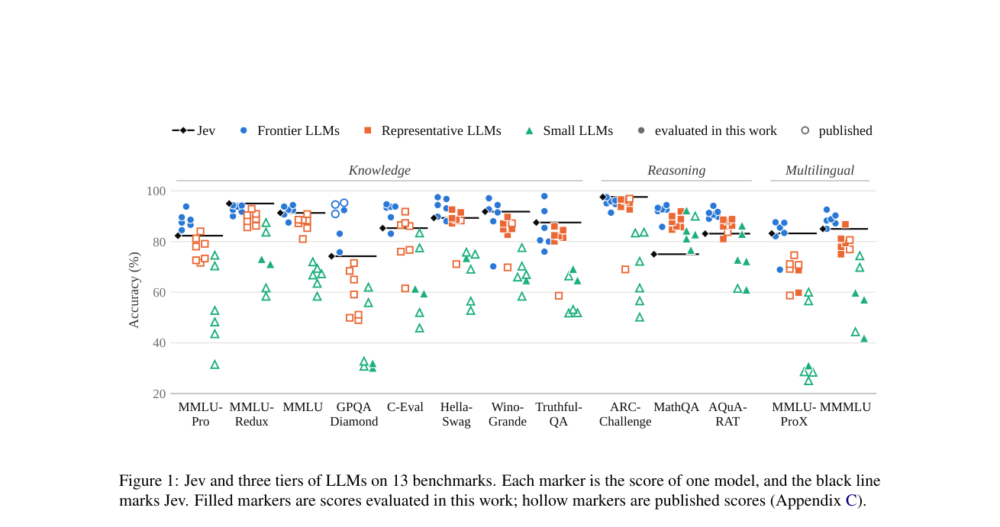

# Jev 能力边界评测

## 论文信息

| 字段 | 内容 |
| --- | --- |
| 论文链接 | [arXiv 2610.11978](https://arxiv.org/abs/2610.11978) |
| 一作机构 / 公司 / 学校 | 大连海事大学（Xing Li、Qingcheng Chang 共同一作） |
| 首次公开日期 | 2026-10-08（arXiv v1） |
| 原作者开源代码 | 截至 2026-10-10 未找到；TypeSafe Jev 权重不公开 |
| 本地 Adapter | `jev-capability`（评测入口，不是新的模型训练算法） |
| 本地复现代码 | `src/auto_research/system_one/capability_bench.py`、`capability_data.py`；入口 `scripts/run_jev_capability.py` |

## 原始论文总结

### 背景与主要改动

论文用有限候选选择评估 Jev 的知识、推理和多语言能力。每题只提交问题与候选，运行一次；数学任务表现弱于知识任务。原文中的供应商分数与作者实测并非统一提示协议，本地实现因此分别记录，不混成可比排名。本文是评测研究，不提供新架构或训练目标。



<!-- paper-figure:start -->
### 原论文关键图

[](https://arxiv.org/pdf/2610.11978v1#page=2)

> **原论文 Figure 1（关键图）**：黑线代表论文中的闭源 Jev；各点代表不同 LLM 的成绩。实心点是作者实测，空心点是公开报告分数，二者提示与协议可能不同，不能直接当统一排名。该图不是本地开放 NanoJev 的结果。图片来自[原论文](https://arxiv.org/abs/2610.11978)，版权归原作者所有；点击图片可查看来源。
<!-- paper-figure:end -->

## 数据与评测契约

支持 MMLU-Pro、MMLU-Redux、MMLU、GPQA Diamond、C-Eval、HellaSwag、WinoGrande、TruthfulQA MC1、ARC-Challenge、MathQA、AQuA-RAT、MMLU-ProX 和 MMMLU。

- 官方 Hugging Face 数据源登记在 `capability_data.DATASETS`；下载要求完整 40 位 revision，不执行远程数据集 Python 脚本。
- 保留数据来源、配置、语言、原始 split、规范化 SHA256、样本数和排除原因。GPQA 的候选使用固定种子排列，不把正确选项固定在 A。
- Redux 对明确的错误标签使用公开修正索引；歧义、无正确答案或无法映射的修正显式排除。这是本地清洗约定，不能假定与论文完全一致。
- 无公开标签的 C-Eval test 不猜答案。可显式选择有标签的 validation，但结果仍记录 `source_split=validation`，不能称官方 test 复现。
- 多语言任务每个配置显式传语言；不把一个英语子集称为 29 / 14 语言完整覆盖。
- 多语言汇总使用语言宏平均，同时保留样本加权准确率与实际语言数；二者不能混淆。
- 数学解释、CoT、标准答案不进入模型请求。准确率为正确选择数除以题数；报告 Wilson 95% 区间。非法选择算错误，不自动重试或替换。

## 如何运行

安装仓库并准备固定版本的公开数据：

```bash
pip install -e '.[system-one-gpu]'
PYTHONPATH=src python scripts/run_jev_capability.py prepare \
  --benchmark arc-challenge --config ARC-Challenge --language en \
  --revision 210d026faf9955653af8916fad021475a3f00453 \
  --output data/system-one-capability/arc.jsonl
```

运行已下载的开放 NanoJev checkpoint：

```bash
PYTHONPATH=src python scripts/run_jev_capability.py evaluate \
  --backend nanojev --checkpoint-dir checkpoints/nanojev --device cuda:0 \
  --data data/system-one-capability/arc.jsonl \
  --output runs/jev-capability/report.json
```

`--data` 可同时传多个任务、科目和语言的 JSONL；每个文件必须有自动生成的 `.source.json`。其他数据集使用相同 `prepare` 命令，配置名和语言以对应官方数据页为准。GPQA 的登录许可失败会直接报错，不拿代理数据替代。

真实闭源 Jev 对照仅在显式提供 `TYPESAFE_API_KEY` 后使用 `--backend typesafe`。这会调用在线服务；密钥不进入产物。当前本地固定温度评测不使用测试集调参，也不把重复确定性运行当多 seed 证据。

## 本地验证与边界

规范化的 13 种 schema、候选排列、标签隔离、文件哈希和引用 / 实测分离已有行为测试。2026-10-10 在 A100 上使用固定 NanoJev checkpoint 对 ARC-Challenge 官方全部 1,172 道 test 题执行一次，327 题正确，准确率 27.90%，Wilson 95% 区间 25.41%–30.54%；没有用测试题训练、选参或重试。数据与 checkpoint revision 见[脱敏 GPU 证据](../../gpu-validations/jev-capability-a100-20261010.json)。该结果仅对应开放 NanoJev，不是论文闭源 Jev 的 97.6%。其余 12 个任务尚未实测，在报告 `coverage.missing` 显示，不能以“接口支持”掩盖未评测。

本入口评估选择能力，不训练模型；暂不作为 evolve 的可训练 operator。闭源 Jev 和开放 NanoJev 始终是不同后端，报告明确标记，不能把开放模型的结果冠以官方 Jev。

来源：[论文全文](https://arxiv.org/html/2610.11978v1)、[ARC 官方数据](https://huggingface.co/datasets/allenai/ai2_arc)、[Redux 修正标签](https://huggingface.co/datasets/edinburgh-dawg/mmlu-redux-2.0)、[TruthfulQA MC1](https://huggingface.co/datasets/truthfulqa/truthful_qa)。
