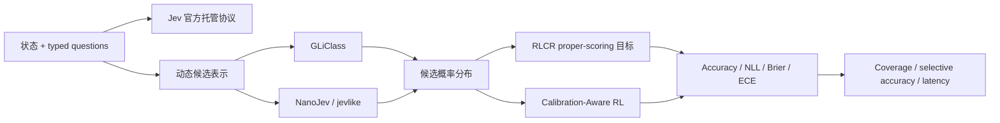

# 结构化决策论文谱系与缺口

## 当前谱系

这张图表达可公开验证的方法关系，不表示 Jev 使用 GLiClass、RLCR 或任何社区实现的内部结构。

## 已覆盖主干

- 官方 Choice、Score、Noul 请求与响应契约，以及安全的可选 HTTPS provider；
- 动态候选 bilinear 与 rival-centered scorer；
- cross-entropy、Brier 和 hybrid 校准目标；
- validation-only 温度选择与 held-out test；
- Banking77 三种子公开基线和 Evolve 可执行 operator；
- NanoJev、jevlike 与论文官方代码的来源边界。

## P0：官方证据边界

TypeSafe 尚未公开 Jev 的技术论文、权重、训练数据和内部架构。本仓库必须持续把“官方可调用行为”和“独立本地机制”分开，不根据产品输出反推或宣称复现其内部网络。

## P1：选择性预测与多原语评测 {#selective-prediction}

当前 Banking77 主要覆盖 Choice。后续需要增加：

1. Score 的有序 rubric 数据集与 ordinal calibration；
2. Noul 的布尔风险/审核数据集与成本敏感阈值；
3. abstention、coverage-risk curve 和分布外动态候选；
4. 在用户提供 API key 后，以固定公开样本做 Jev 在线黑盒协议对照。

## P1：开放 checkpoint 对照

需要在相同数据切分和预算下接入 GLiClass、NanoJev 或其他公开 checkpoint，比较准确率、校准、延迟和显存，而不是把不同仓库的自报数字横向拼接。

## 纳入标准

新方法至少应提供动态候选、类型化评分、概率校准、选择性预测或机器可执行决策中的一个定义性机制；仅把生成式 LLM 的文本答案改成 JSON，不单独构成 System One 方法。
