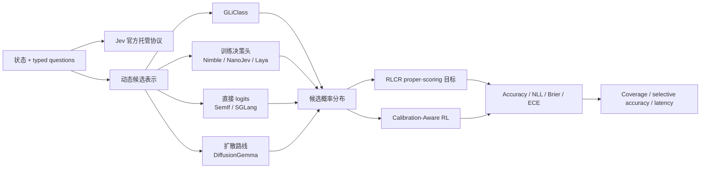

# 结构化决策论文谱系与缺口

## 当前谱系

这张图表达可公开验证的方法关系，不表示 Jev 使用 GLiClass、RLCR 或任何社区实现的内部结构。

## 已覆盖主干

- 官方 Choice、Score、Noul 请求与响应契约，以及安全的可选 HTTPS provider；
- 动态候选 bilinear 与 rival-centered scorer；
- cross-entropy、Brier 和 hybrid 校准目标；
- validation-only 温度选择与 held-out test；
- Banking77 三种子公开基线和 Evolve 可执行 operator；
- 48 项社区资料按训练模型、直接 logits、扩散路线、先验工作和评测索引分层；
- Bespoke Nimble、NanoJev、Laya 与 SemIf 等项目的来源和能力边界。

## P0：官方证据边界

TypeSafe 尚未公开 Jev 的技术论文、权重、训练数据和内部架构。本仓库必须持续把“官方可调用行为”和“独立本地机制”分开，不根据产品输出反推或宣称复现其内部网络。

## P1：选择性预测与多原语评测 {#selective-prediction}

当前 Banking77 主要覆盖 Choice。后续需要增加：

1. Score 的有序 rubric 数据集与 ordinal calibration；
2. Noul 的布尔风险/审核数据集与成本敏感阈值；
3. abstention、coverage-risk curve 和分布外动态候选；
4. 在用户提供 API key 后，以固定公开样本做 Jev 在线黑盒协议对照。

## P0：开放 checkpoint 对照

优先在相同数据切分和预算下接入 Bespoke Nimble、NanoJev、Laya，比较准确率、校准、延迟和显存，而不是把不同仓库的自报数字横向拼接。三者目前是“已收录、待接入”，完成适配和真实执行后才能进入实验看板。

## P1：工程与评测对照

1. 用 SemIf 与 openjev-sglang 建立直接 logits / 并行约束解码的延迟基线；
2. 审核 jev-benchmarks、jev-ood-calibration 和 behavior-study 的数据许可与 gold 隔离；
3. 将 DiffusionGemma 路线作为独立实验轴，不与训练式 checkpoint 混排行；
4. 保持[社区实现全量快照](implementation-tracker.md)和[选型路线图](implementations.md)分离，避免“收录”被误读为“已实现”。

## 纳入标准

新方法至少应提供动态候选、类型化评分、概率校准、选择性预测或机器可执行决策中的一个定义性机制；仅把生成式 LLM 的文本答案改成 JSON，不单独构成 System One 方法。
